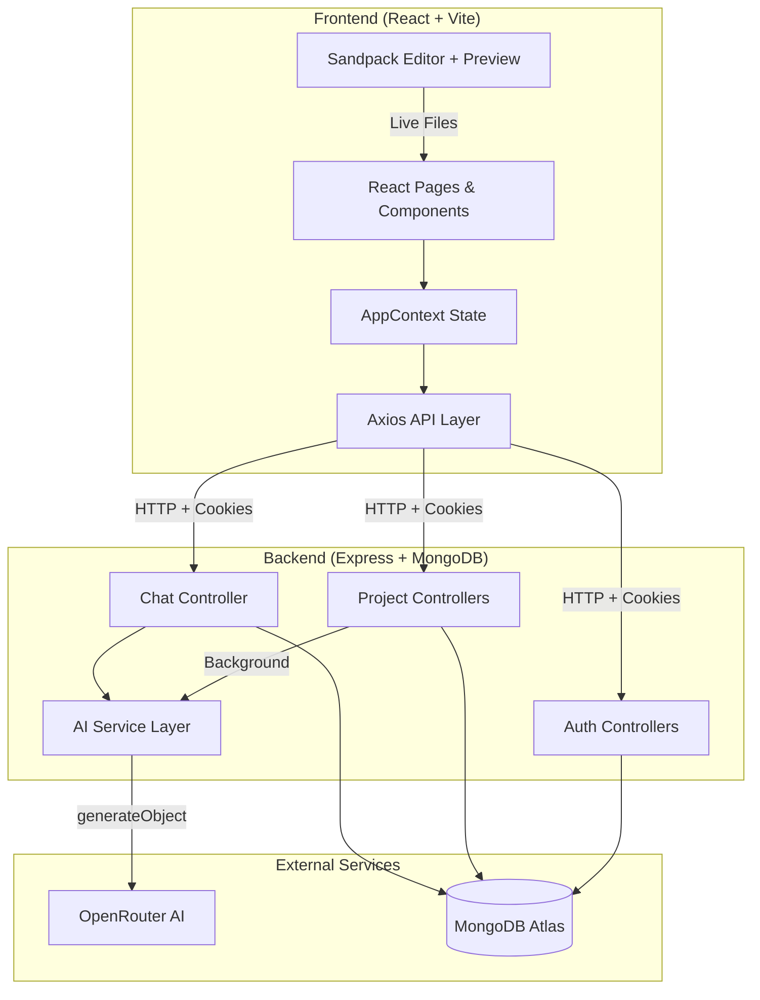
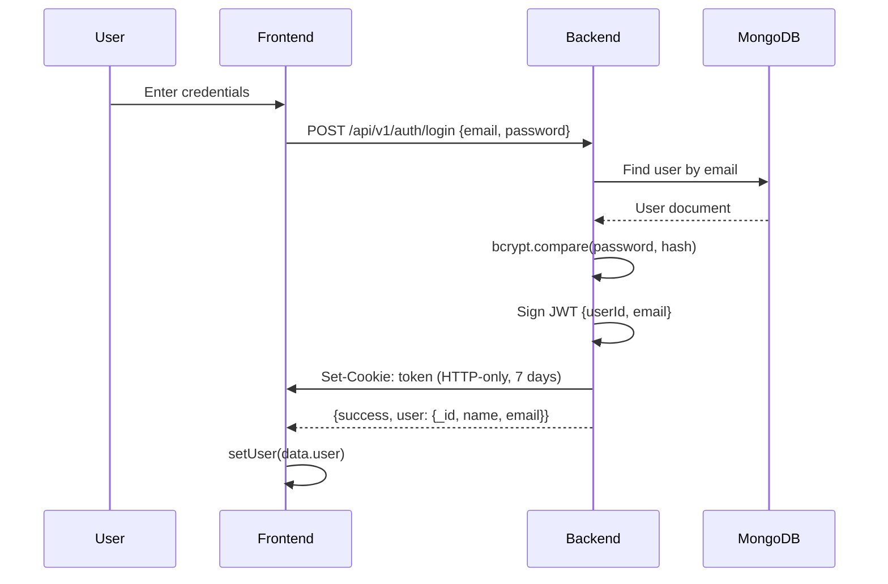
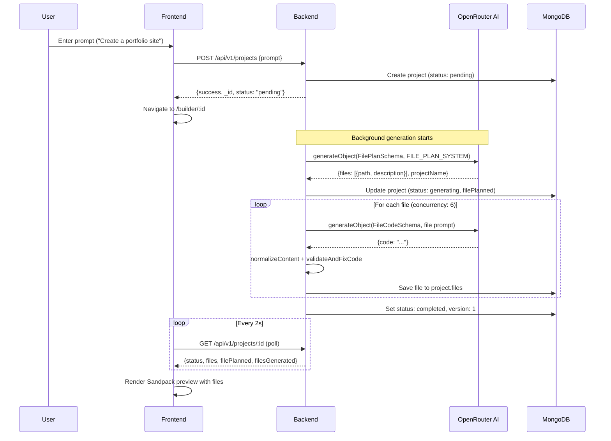
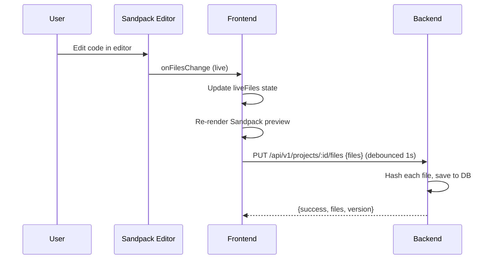
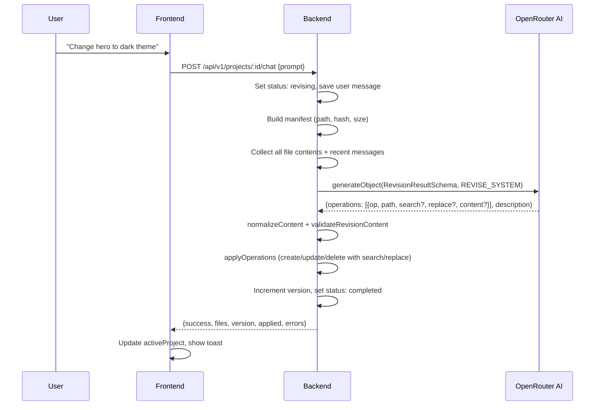
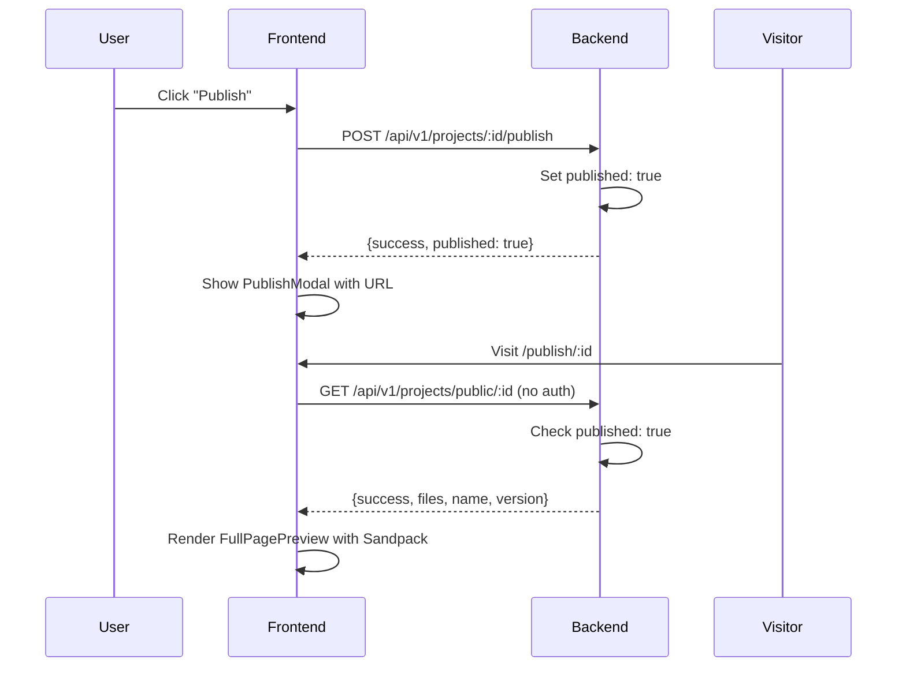

# Builder AI — AI-Powered Website Builder

> Describe what you need. AI builds it. Edit live. Publish instantly.

## About

Builder AI is a full-stack web application that transforms natural language descriptions into production-ready React websites. Users describe a website in plain English, and an AI agent plans the file structure, generates complete JSX/CSS code, and presents a live editable preview — all in real time.

## The Problem

Building a website from scratch requires knowledge of React, component architecture, styling, and project setup — a process that can take hours or days. Builder AI eliminates this barrier by letting anyone describe their vision in natural language and receiving a fully functional, visually polished React project in seconds.

## How It Works

1. **Describe** — Type a natural language prompt (e.g., "Create a SaaS landing page for a project management tool")
2. **Generate** — AI plans the file structure, then generates each file in parallel with retry logic
3. **Edit** — Modify code in the built-in Sandpack editor with live preview
4. **Revise** — Ask AI to make changes via chat (e.g., "Change the hero color to blue")
5. **Publish** — One-click publish to a public URL
6. **Export** — Download as a ready-to-deploy ZIP with Vite + React + Tailwind

## Key Features

| Feature | Description |
|---------|-------------|
| AI Code Generation | Generates complete React projects from natural language prompts using OpenRouter AI |
| Real-time Preview | Live Sandpack-powered preview with instant hot reload |
| Built-in Code Editor | Full Monaco editor with syntax highlighting, line numbers, and inline errors |
| AI Revision Chat | Conversational interface to iteratively refine generated code |
| File Explorer | Tree-view file browser with file-type icons |
| Publishing | One-click publish to a shareable public URL |
| ZIP Export | Download project as a deployable ZIP with package.json, Vite config, and all source files |
| Progress Dashboard | Real-time file-by-file generation progress with status indicators |
| Authentication | Secure JWT HTTP-only cookie-based session management |

## Architecture Overview



## Tech Stack

### Frontend

| Technology | Purpose |
|-----------|---------|
| React 19 | UI library with hooks and context-based state management |
| Vite 8 | Build tool and dev server with HMR |
| Tailwind CSS 4 | Utility-first styling via Vite plugin |
| Sandpack | CodeSandbox-powered live code editor and preview |
| Axios | HTTP client with credential/cookie support |
| React Router 7 | Client-side routing with layout guards |
| React Hot Toast | Toast notifications |
| Lucide React | Icon library |
| JSZip + FileSaver | ZIP export functionality |
| lodash.debounce | Debounced file save to backend |
| Moment.js | Relative time formatting |

### Backend

| Technology | Purpose |
|-----------|---------|
| Express 5 | Web framework with async error handling |
| MongoDB + Mongoose | Database and ODM for document storage |
| JSON Web Tokens | Stateless authentication via HTTP-only cookies |
| bcrypt | Password hashing with salt rounds |
| Vercel AI SDK | Structured AI output generation with Zod schemas |
| OpenRouter | AI model API (default: `cohere/north-mini-code:free`) |
| Zod | Schema validation for AI responses |
| p-map | Concurrent async file generation with configurable limits |
| cookie-parser | Cookie parsing middleware |
| cors | Cross-origin resource sharing |

## Project Structure

```
ai-website-builder/
├── frontend/
│   ├── public/                    # Static assets (logo, icons, bg image)
│   ├── src/
│   │   ├── api/
│   │   │   └── api.js            # Axios instance with baseURL + credentials
│   │   ├── assets/
│   │   │   └── assets.js         # Home page tag presets
│   │   ├── components/
│   │   │   ├── AgentProgressDashboard.jsx  # AI generation progress UI
│   │   │   ├── BuildHeader.jsx             # Builder page toolbar
│   │   │   ├── ChatPanel.jsx               # AI chat conversation UI
│   │   │   ├── FileExplorer.jsx            # Tree-view file browser
│   │   │   ├── FullPagePreview.jsx         # Sandpack preview-only mode
│   │   │   ├── Loading.jsx                 # Full-screen spinner
│   │   │   ├── LoginLeft.jsx               # Auth page branding panel
│   │   │   ├── PreviewPanel.jsx            # Sandpack editor + live preview
│   │   │   ├── PromptInput.jsx             # Reusable textarea + submit
│   │   │   ├── PublishModal.jsx            # Post-publish success modal
│   │   │   └── SandPackErrorMonitor.jsx    # Silences network errors
│   │   ├── context/
│   │   │   └── AppContext.jsx              # Global state (auth, projects, chat)
│   │   ├── pages/
│   │   │   ├── AuthPage.jsx       # Login / Register
│   │   │   ├── BuilderPage.jsx    # Main builder workspace
│   │   │   ├── HomePage.jsx       # Dashboard + project list
│   │   │   ├── Layout.jsx         # Auth/Guest layout route guards
│   │   │   ├── PreviewPage.jsx    # Full-screen Sandpack preview
│   │   │   └── PublishPage.jsx    # Public published site viewer
│   │   ├── utils/
│   │   │   ├── exportProject.js   # ZIP export with JSZip
│   │   │   └── sandpackUtils.js   # Dependency detection from imports
│   │   ├── App.jsx                # Router definition
│   │   ├── index.css              # Global styles + Sandpack overrides
│   │   └── main.jsx               # Entry point
│   ├── .env                       # VITE_BASE_URL
│   ├── index.html
│   ├── package.json
│   └── vite.config.js
│
├── backend/
│   ├── src/
│   │   ├── config/
│   │   │   └── database.js        # MongoDB connection
│   │   ├── controllers/
│   │   │   ├── auth.controllers.js    # Register, Login, Logout, Me
│   │   │   ├── project.controllers.js # CRUD + publish + background AI
│   │   │   └── chat.controllers.js    # Revision chat endpoint
│   │   ├── middleware/
│   │   │   └── auth.middleware.js     # JWT cookie verification
│   │   ├── models/
│   │   │   ├── user.models.js         # User schema with bcrypt
│   │   │   └── project.model.js       # Project + Message + PlannedFile schemas
│   │   ├── routes/
│   │   │   ├── auth.routes.js         # /api/v1/auth/*
│   │   │   └── project.routes.js      # /api/v1/projects/*
│   │   ├── services/
│   │   │   ├── ai.js                  # AI generation orchestration
│   │   │   ├── aiSchemas.js           # Zod schemas for structured output
│   │   │   ├── codeValidator.js       # Post-generation code auto-fixer
│   │   │   ├── contentNormalizer.js   # Fix AI encoding issues
│   │   │   ├── diff.js               # File operation applier (create/update/delete)
│   │   │   └── prompts.js            # All system prompts for AI
│   │   └── server.js              # Express app entry point
│   ├── .env                       # PORT, MONGODB_URI, JWT_SECRET, OPENROUTER_API_KEY
│   ├── package.json
│   └── tsconfig.json
│
└── README.md                      # This file
```

## End-to-End Flow

### Authentication Flow



### AI Website Generation Flow



### Project Editing & Saving Flow



### AI Revision Chat Flow



### Publishing & Public Preview Flow



## API Endpoints

### Auth (`/api/v1/auth`)

| Method | Path | Auth | Description |
|--------|------|------|-------------|
| POST | `/register` | No | Create account, set session cookie |
| POST | `/login` | No | Authenticate, set session cookie |
| POST | `/logout` | No | Clear session cookie |
| POST | `/me` | Yes | Return current authenticated user |

### Projects (`/api/v1/projects`)

| Method | Path | Auth | Description |
|--------|------|------|-------------|
| POST | `/` | Yes | Create project + start AI generation |
| GET | `/` | Yes | List user's projects |
| GET | `/:id` | Yes | Get full project details |
| DELETE | `/:id` | Yes | Delete a project |
| PUT | `/:id/files` | Yes | Update project files (manual save) |
| POST | `/:id/publish` | Yes | Mark project as published |
| GET | `/public/:id` | No | Fetch published project (public) |
| POST | `/:id/chat` | Yes | Send revision prompt to AI |

## Environment Variables

### Frontend (`.env`)

| Variable | Description | Example |
|----------|-------------|---------|
| `VITE_BASE_URL` | Backend API base URL | `http://localhost:3000/api/v1` |

### Backend (`.env`)

| Variable | Description | Example |
|----------|-------------|---------|
| `PORT` | Server port | `3000` |
| `ORIGINS` | CORS allowed origins (comma-separated) | `http://localhost:5173, http://localhost:3000` |
| `MONGODB_URI` | MongoDB Atlas connection string | `mongodb+srv://...` |
| `JWT_SECRET` | Secret key for JWT signing | `your-secret-key` |
| `OPENROUTER_API_KEY` | OpenRouter API key | `sk-or-v1-...` |
| `OPENROUTER_MODEL` | AI model identifier | `cohere/north-mini-code:free` |

## Installation & Setup

### Prerequisites

- Node.js 18+ or Bun
- MongoDB Atlas account (or local MongoDB)
- OpenRouter API key

### Backend

```bash
cd backend
npm install
# Configure .env with your MongoDB URI, JWT secret, and OpenRouter key
npm start
# Server runs on http://localhost:3000
```

### Frontend

```bash
cd frontend
npm install
# .env is pre-configured for localhost:3000
npm run dev
# Frontend runs on http://localhost:5173
```

## Production Deployment

### Backend

- Set `NODE_ENV=production` in `.env`
- Ensure `ORIGINS` includes your production frontend domain
- The `secure` cookie flag activates automatically in production
- Deploy to any Node.js hosting (Vercel, Railway, Render, etc.)

### Frontend

```bash
cd frontend
npm run build
# Output: dist/ directory — serve with any static hosting
```

- Update `VITE_BASE_URL` to your production backend URL before building
- Deploy `dist/` to Vercel, Netlify, Cloudflare Pages, etc.

## Important Implementation Details

### Background AI Generation

When a project is created, the HTTP response returns immediately with status `pending`. AI generation runs as a fire-and-forget background task using `runBackgroundGeneration()`. The frontend polls `GET /projects/:id` every 2 seconds to receive progressive updates (planned files, current file being generated, completed files).

### File Storage

All project files are stored in MongoDB as a `Mixed` (object) field where keys are file paths (e.g., `/App.js`, `/components/Header.js`) and values are `{content: string, hash: string}`. The hash is an MD5 prefix used for change detection.

### Code Validation Pipeline

After AI generates each file, it passes through `contentNormalizer.js` (fixes escaped newlines, BOM characters) and `codeValidator.js` (fixes `class=` → `className=`, self-closes void elements, ensures default exports, fixes import paths, strips TypeScript syntax).

### Sandpack Integration

The frontend uses `@codesandbox/sandpack-react` to provide a live code editor and preview. Files are converted from `{path: content}` to Sandpack's `{path: {code, active}}` format. A `SandpackFileWatcher` component monitors editor changes and debounces saves to the backend.

## Future Improvements

- Rate limiting on auth and generation endpoints
- Filesystem-based project storage for large projects
- Image/media asset support in generated projects
- Multiple AI model selection per user
- Project version history and rollback
- Team collaboration and sharing
- Custom domain publishing
- Template marketplace

## License

Private — All rights reserved.
