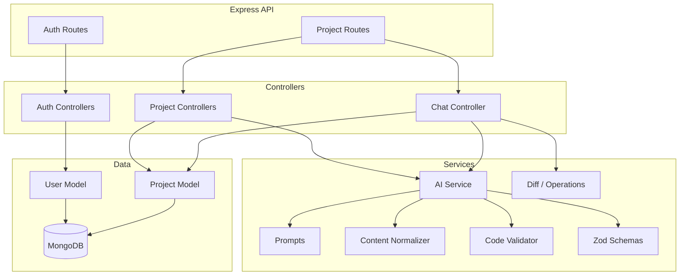
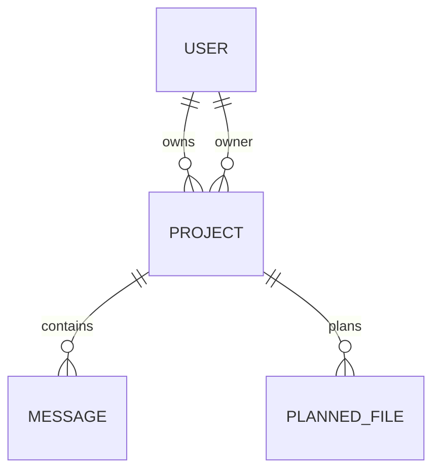
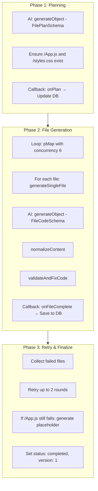
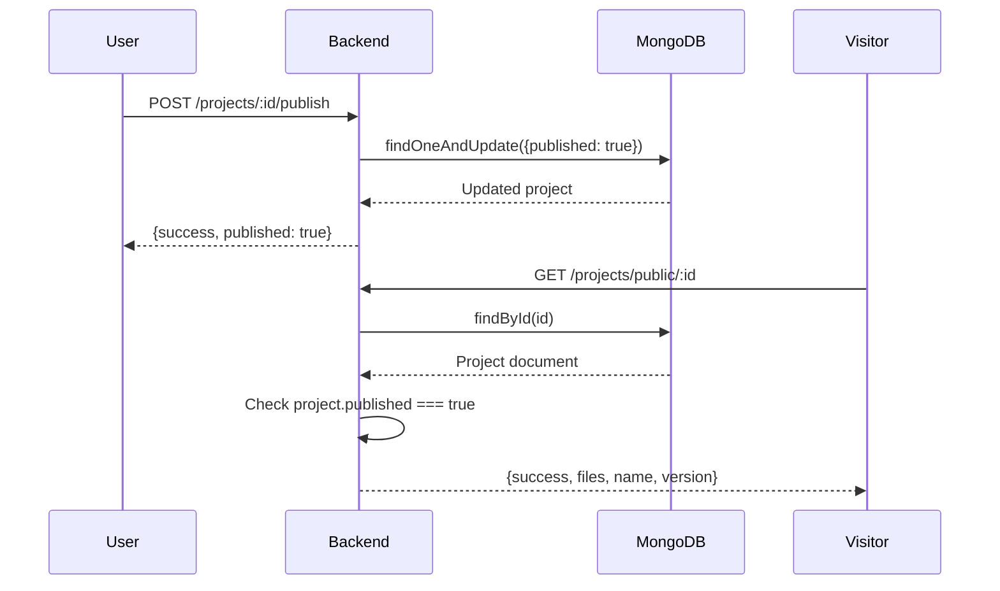

# Builder AI — Backend

> Express + MongoDB backend powering the AI Website Builder.

## Overview

The backend is a RESTful API server built with Express 5 and MongoDB. It handles user authentication, project CRUD operations, AI-powered website generation via OpenRouter, revision chat, file management, and publishing. AI generation runs as background tasks with progressive status updates stored in MongoDB.

## Responsibilities

- User authentication with JWT HTTP-only cookies
- Project CRUD operations
- AI website generation orchestration (planning + file generation)
- AI revision chat (search/replace operations on existing files)
- Progressive generation status tracking
- File storage and versioning in MongoDB
- Publishing public project URLs
- Post-generation code validation and auto-fixing

## Architecture



## Tech Stack

| Technology | Version | Purpose |
|-----------|---------|---------|
| Express | 5.x | Web framework with native async error handling |
| MongoDB | Atlas | Cloud database for document storage |
| Mongoose | 9.x | MongoDB ODM with schema validation |
| JSON Web Token | 9.x | Stateless auth via signed HTTP-only cookies |
| bcrypt | 6.x | Password hashing (10 salt rounds) |
| Vercel AI SDK | 7.x | Structured AI output with `generateObject()` |
| @ai-sdk/openai | 4.x | OpenRouter-compatible AI provider |
| Zod | 4.x | Schema validation for AI structured output |
| p-map | 7.x | Concurrent async file generation with limits |
| cookie-parser | 1.x | Parse cookies from request headers |
| cors | 2.x | Cross-origin resource sharing |
| dotenv | 17.x | Environment variable loading |

## Folder Structure

```
backend/
├── src/
│   ├── config/
│   │   └── database.js            # MongoDB connection via Mongoose
│   ├── controllers/
│   │   ├── auth.controllers.js    # Register, Login, Logout, Me
│   │   ├── project.controllers.js # CRUD, publish, background AI generation
│   │   └── chat.controllers.js    # Revision chat endpoint
│   ├── middleware/
│   │   └── auth.middleware.js     # JWT cookie verification middleware
│   ├── models/
│   │   ├── user.models.js         # User schema with bcrypt hashing
│   │   └── project.model.js       # Project, Message, PlannedFile schemas
│   ├── routes/
│   │   ├── auth.routes.js         # /api/v1/auth/* routes
│   │   └── project.routes.js      # /api/v1/projects/* routes
│   ├── services/
│   │   ├── ai.js                  # AI generation orchestration
│   │   ├── aiSchemas.js           # Zod schemas for structured output
│   │   ├── codeValidator.js       # Post-generation code auto-fixer
│   │   ├── contentNormalizer.js   # Fix AI encoding issues
│   │   ├── diff.js               # File operation applier (create/update/delete)
│   │   └── prompts.js            # All system prompts for AI
│   └── server.js                  # Express app entry point
├── .env                           # Environment variables
├── package.json                   # Dependencies and scripts
└── tsconfig.json                  # TypeScript config (for Bun runtime)
```

## Models & Database Relationships

### User Model

```javascript
{
  name:       String (required, trimmed)
  email:      String (required, unique, lowercase, trimmed)
  password:   String (required, select: false)  // Excluded from queries by default
  createdAt:  Date (auto)
  updatedAt:  Date (auto)
}
```

**Methods:**
- `comparePassword(password)` — bcrypt compare (instance method)
- Pre-save hook hashes password with bcrypt (10 salt rounds)

### Project Model

```javascript
{
  name:            String (default: "Untitled Project")
  description:     String (default: "")
  files:           Mixed (Map of path → {content, hash}) (default: {})
  messages:        [MessageSchema]
  version:         Number (default: 0)
  owner:           ObjectId ref "User" (required)
  published:       Boolean (default: false)
  status:          Enum ["pending", "generating", "revising", "completed", "failed"]
  filePlanned:     [PlannedFileSchema] (path + description)
  filesGenerated:  [String]
  currentFile:     String (nullable)
  error:           String (nullable)
  createdAt:       Date
  updatedAt:       Date
}
```

### MessageSchema (Embedded)

```javascript
{
  role:     Enum ["user", "assistant"] (required)
  content:  String (required)
  timestamps: true
}
```

### PlannedFileSchema (Embedded, no _id)

```javascript
{
  path:        String (required)
  description: String (required)
}
```

### Relationships



## Controllers

### Auth Controllers (`auth.controllers.js`)

| Function | Description |
|----------|-------------|
| `register(req, res)` | Validate fields, check uniqueness, create user, set session cookie |
| `login(req, res)` | Find user, compare password, set session cookie |
| `logout(req, res)` | Clear token cookie |
| `me(req, res)` | Return current user from JWT payload |

### Project Controllers (`project.controllers.js`)

| Function | Description |
|----------|-------------|
| `createProject(req, res)` | Create project with status "pending", start background AI generation |
| `runBackgroundGeneration(id, prompt)` | Fire-and-forget: plan → generate files → update status |
| `listProjects(req, res)` | Return all projects owned by user (summary fields only) |
| `getProject(req, res)` | Return full project with flattened file content |
| `deleteProject(req, res)` | Delete project by ID (owner only) |
| `updateProjectFiles(req, res)` | Replace all project files (debounced from frontend) |
| `publishProject(req, res)` | Set `published: true` |
| `getPublicProject(req, res)` | Return project if published (no auth required) |

### Chat Controller (`chat.controllers.js`)

| Function | Description |
|----------|-------------|
| `buildManifest(files)` | Build compact manifest: `{path, hash, size}` for each file |
| `chat(req, res)` | Send revision prompt → AI returns operations → apply to files → return updated project |

## API Endpoints

### Auth Routes (`/api/v1/auth`)

| Method | Path | Auth | Handler | Description |
|--------|------|------|---------|-------------|
| POST | `/register` | No | `register` | Create account + set cookie |
| POST | `/login` | No | `login` | Authenticate + set cookie |
| POST | `/logout` | No | `logout` | Clear cookie |
| POST | `/me` | Yes | `me` | Return authenticated user |

### Project Routes (`/api/v1/projects`)

| Method | Path | Auth | Handler | Description |
|--------|------|------|---------|-------------|
| GET | `/public/:id` | No | `getPublicProject` | Fetch published project |
| POST | `/` | Yes | `createProject` | Create + start AI generation |
| GET | `/` | Yes | `listProjects` | List user's projects |
| GET | `/:id` | Yes | `getProject` | Get full project details |
| DELETE | `/:id` | Yes | `deleteProject` | Delete project |
| PUT | `/:id/files` | Yes | `updateProjectFiles` | Save edited files |
| POST | `/:id/publish` | Yes | `publishProject` | Mark as published |
| POST | `/:id/chat` | Yes | `chat` | Send revision to AI |

### Response Format

All endpoints return a consistent JSON structure:

```json
{
  "success": true,
  "message": "Description of result",
  // ... additional data fields
}
```

Error responses:

```json
{
  "success": false,
  "message": "Error description"
}
```

## Authentication Architecture

### JWT + HTTP-Only Cookie Flow

```mermaid
sequenceDiagram
    participant C as Client
    participant S as Server
    participant DB as MongoDB

    C->>S: POST /auth/login {email, password}
    S->>DB: User.findOne({email})
    DB-->>S: User document
    S->>S: bcrypt.compare(password, user.password)
    S->>S: jwt.sign({userId, email}, secret, {expiresIn: "7d"})
    S->>C: Set-Cookie: token=eyJ...; HttpOnly; SameSite=Lax; Path=/
    S-->>C: {success: true, user: {_id, name, email}}
```

### Cookie Configuration

| Property | Value |
|----------|-------|
| Name | `token` |
| HttpOnly | `true` (not accessible via JavaScript) |
| Secure | `true` only when `NODE_ENV=production` |
| SameSite | `lax` |
| MaxAge | 7 days |
| Path | `/` |

### JWT Payload

```json
{
  "userId": "user_id_string",
  "email": "user@example.com",
  "iat": 1234567890,
  "exp": 1235172690
}
```

## Authentication Middleware

`authMiddleware` in `middleware/auth.middleware.js`:

1. Extracts token from `req.cookies.token`
2. Verifies JWT with `jwt.verify(token, JWT_SECRET)`
3. Attaches decoded payload to `req.user`
4. Returns 401 if token is missing or invalid

Applied globally to all `/api/v1/projects` routes via `projectRouter.use(authMiddleware)`, except the public route defined before the middleware.

## AI / Background Generation Architecture

### Generation Pipeline



### AI Configuration

| Setting | Value |
|---------|-------|
| Provider | OpenRouter (`https://openrouter.ai/api/v1`) |
| Default Model | `cohere/north-mini-code:free` |
| Max Concurrency | 6 (configurable via `AI_MAX_CONCURRENCY`) |
| Max Retry Rounds | 2 |
| Output Format | Structured (Zod schemas via `generateObject()`) |

### AI Schemas (`aiSchemas.js`)

| Schema | Used For | Shape |
|--------|----------|-------|
| `FilePlanSchema` | Planning file structure | `{files: [{path, description, exports, imports}], projectName, projectDescription}` |
| `FileCodeSchema` | Generating single file | `{code: string}` |
| `RevisionResultSchema` | Revision chat | `{operations: [{op, path, content?, search?, replace?}], description}` |

### Content Normalizer (`contentNormalizer.js`)

Fixes common AI output encoding issues:
- Removes BOM characters
- Normalizes `\r\n` to `\n`
- Fixes double-escaped newlines (`\\n` → real newline)
- Fixes escaped quotes in JSX attributes (`className=\"...\"` → `className="..."`)

### Code Validator (`codeValidator.js`)

Post-generation auto-fixer with 9 rules:
1. Strip markdown code fences
2. Fix `class=` → `className=`
3. Fix `for=` → `htmlFor=`
4. Self-close void elements (``, `<br>`, etc.)
5. Ensure exactly one default export
6. Remove HTML comments (invalid in JSX)
7. Strip TypeScript syntax (`React.FC`, type annotations)
8. Add missing React import
9. Fix incorrect import paths based on planned file structure

### Diff / Operations (`diff.js`)

Applies AI revision operations to project files:

| Operation | Description |
|-----------|-------------|
| `create` | Add new file with full content |
| `update` | Search/replace within existing file (exact match, then whitespace-normalized fallback) |
| `delete` | Remove a file |

The `searchReplace()` function uses a two-pass approach:
1. **Exact match** — Direct string inclusion check
2. **Normalized match** — Collapses whitespace per line, then matches line-by-line to find the original position

## Publishing & Public Project Flow



Public projects are accessible without authentication. The endpoint only returns data if `project.published === true`.

## Error Handling

### Global Error Handler

Express catches unhandled errors via the final middleware:

```javascript
app.use((err, _req, res, _next) => {
    console.error(`[Error]: ${err.message}`);
    res.status(500).json({
        success: false,
        message: 'Global Internal Server Error',
        error: err.message
    });
});
```

### Controller-Level Error Handling

Every controller function wraps its logic in `try/catch` and returns appropriate HTTP status codes:

| Status | When |
|--------|------|
| 400 | Missing or invalid request body |
| 401 | No token, invalid token, or unauthorized |
| 404 | Resource not found or not owned by user |
| 409 | Duplicate email on registration |
| 500 | Server error |

### Background Generation Errors

If background AI generation fails, the error is caught and the project status is set to `"failed"` with the error message stored in `project.error`. The frontend polls this status and displays it in the `AgentProgressDashboard`.

## Environment Variables

| Variable | Required | Description | Default |
|----------|----------|-------------|---------|
| `PORT` | No | Server port | `5000` |
| `ORIGINS` | Yes | CORS origins (comma-separated) | — |
| `MONGODB_URI` | Yes | MongoDB connection string | — |
| `JWT_SECRET` | Yes | JWT signing secret | — |
| `OPENROUTER_API_KEY` | Yes | OpenRouter API key | — |
| `OPENROUTER_MODEL` | No | AI model identifier | `cohere/north-mini-code:free` |
| `AI_MAX_CONCURRENCY` | No | Parallel file generation limit | `6` |
| `NODE_ENV` | No | Environment (`production` enables secure cookies) | `development` |

## Development

```bash
npm install
# Configure .env with MongoDB URI, JWT secret, and OpenRouter key
npm run server    # Start with nodemon (auto-reload)
npm start         # Start with node (production)
```

## Production Deployment

- Set `NODE_ENV=production` in `.env`
- Ensure `ORIGINS` includes your production frontend domain
- The `secure` cookie flag activates automatically
- Deploy to any Node.js hosting: Vercel, Railway, Render, Fly.io, etc.
- The `start` script runs `node src/server.js`

## Important Implementation Details

### Fire-and-Forget Generation

`createProject` returns the HTTP response immediately after creating the project document with `status: "pending"`. The `runBackgroundGeneration()` function is called without `await`, so it runs independently. Errors from this background process are caught and logged but don't affect the HTTP response.

### File Storage in MongoDB

Files are stored as a `Mixed` (plain object) field in the Project document. Keys are file paths (e.g., `/App.js`), and values are `{content: string, hash: string}`. The hash is the first 12 characters of the MD5 digest, used for change detection.

`markModified("files")` is called before saving because Mongoose doesn't track changes to `Mixed` types automatically.

### Concurrent File Generation

Files are generated in parallel using `p-map` with configurable concurrency (default: 6). Each file generation includes context of the full file plan and already-generated files, so later files can properly import earlier ones.

### Revision Search/Replace

The diff engine supports two matching strategies:
1. **Exact match** — Direct string inclusion
2. **Normalized match** — Whitespace collapsed per line, then line-by-line matching

This handles cases where AI produces slightly different indentation than the original code.

## Future Improvements

- Rate limiting on auth and generation endpoints
- Filesystem-based project storage for large projects
- Project version history and rollback
- Streaming AI responses for real-time generation feedback
- Webhook support for generation completion notifications
- Admin dashboard for project/user management
- API key authentication for programmatic access
- Project templates and cloning
