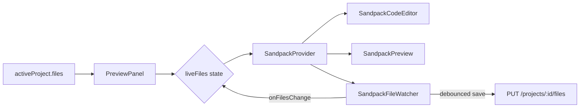
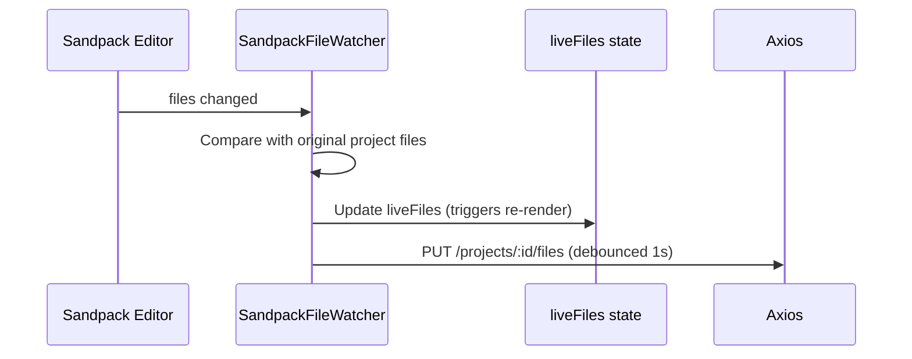

# Builder AI — Frontend

> React-based frontend for the AI Website Builder application.

## Overview

The frontend is a single-page React application that provides the user interface for authentication, project creation, AI-powered code generation, live code editing, and publishing. It communicates with the backend via REST APIs using JWT HTTP-only cookie authentication.

## Responsibilities

- User authentication (login, register, session management)
- Project creation from natural language prompts
- Real-time generation progress display
- Live code editing with Sandpack-powered preview
- AI revision chat interface
- File exploration and navigation
- Project publishing and public preview
- ZIP export of generated projects

## Features

| Feature | Implementation |
|---------|---------------|
| Auth pages | Login/Register with form validation, route guards |
| Dashboard | Project list with creation prompt, delete, and navigation |
| Builder workspace | Split-panel: chat/files sidebar + Sandpack editor/preview |
| Progress dashboard | File-by-file generation progress with status indicators |
| Code editor | Sandpack CodeEditor with tabs, line numbers, inline errors |
| Live preview | Sandpack Preview with Tailwind CDN and Font Awesome |
| Chat panel | Conversational AI revision interface with message history |
| File explorer | Tree-view file browser with file-type icons |
| Publish modal | One-click publish with shareable URL display |
| ZIP export | Download project as deployable ZIP via JSZip |
| Route protection | AuthLayout redirects unauthenticated users; GuestLayout redirects authenticated users |

## Tech Stack

| Technology | Version | Purpose |
|-----------|---------|---------|
| React | 19.x | UI library with hooks |
| Vite | 8.x | Dev server and build tool |
| Tailwind CSS | 4.x | Utility-first CSS via Vite plugin |
| Sandpack | 2.x | CodeSandbox-powered editor and preview |
| Axios | 1.x | HTTP client with cookie support |
| React Router | 7.x | Client-side routing |
| React Hot Toast | 2.x | Toast notifications |
| Lucide React | 1.x | Icon library |
| JSZip | 3.x | ZIP file generation |
| FileSaver | 2.x | Browser file download |
| lodash.debounce | 4.x | Debounced save requests |
| Moment.js | 2.x | Relative time formatting |
| OxLint | 1.x | Fast JavaScript/JSX linter |

## Folder Structure

```
frontend/
├── public/
│   ├── bg-img.png              # Auth page background image
│   ├── favicon.svg             # Browser tab icon
│   ├── icons.svg               # SVG icon sprite
│   └── logo.svg                # Application logo
├── src/
│   ├── api/
│   │   └── api.js              # Axios instance (baseURL + withCredentials)
│   ├── assets/
│   │   ├── assets.js           # Home page tag presets array
│   │   ├── hero.png            # Hero section image
│   │   ├── react.svg           # React logo
│   │   └── vite.svg            # Vite logo
│   ├── components/
│   │   ├── AgentProgressDashboard.jsx   # AI generation progress UI
│   │   ├── BuildHeader.jsx              # Builder page top toolbar
│   │   ├── ChatPanel.jsx                # AI chat conversation UI
│   │   ├── FileExplorer.jsx             # Tree-view file browser
│   │   ├── FullPagePreview.jsx          # Sandpack preview-only mode
│   │   ├── Loading.jsx                  # Full-screen spinner
│   │   ├── LoginLeft.jsx                # Auth page branding panel
│   │   ├── PreviewPanel.jsx             # Sandpack editor + live preview
│   │   ├── PromptInput.jsx              # Reusable textarea + submit
│   │   ├── PublishModal.jsx             # Post-publish success modal
│   │   └── SandPackErrorMonitor.jsx     # Silences Sandpack network errors
│   ├── context/
│   │   └── AppContext.jsx               # Global state provider
│   ├── pages/
│   │   ├── AuthPage.jsx                 # Login / Register page
│   │   ├── BuilderPage.jsx              # Main builder workspace
│   │   ├── HomePage.jsx                 # Dashboard / project list
│   │   ├── Layout.jsx                   # Auth/Guest layout guards
│   │   ├── PreviewPage.jsx              # Full-screen Sandpack preview
│   │   └── PublishPage.jsx              # Public published site viewer
│   ├── utils/
│   │   ├── exportProject.js             # ZIP export with JSZip
│   │   └── sandpackUtils.js             # Dependency detection from imports
│   ├── App.jsx                          # Router definition
│   ├── index.css                        # Global styles + Sandpack overrides
│   └── main.jsx                         # Entry point
├── .env                                 # VITE_BASE_URL
├── .oxlintrc.json                       # Linter configuration
├── index.html                           # HTML entry point
├── package.json                         # Dependencies and scripts
└── vite.config.js                       # Vite configuration
```

## Pages & Routes

| Route | Component | Layout | Description |
|-------|-----------|--------|-------------|
| `/login` | `AuthPage mode="login"` | GuestLayout | Login form |
| `/register` | `AuthPage mode="register"` | GuestLayout | Registration form |
| `/` | `HomePage` | AuthLayout | Dashboard with prompt input and project list |
| `/builder/:id` | `BuilderPage` | AuthLayout | Main builder: chat, files, editor, preview |
| `/preview/:id` | `PreviewPage` | AuthLayout | Full-screen Sandpack preview (new tab) |
| `/publish/:id` | `PublishPage` | Public | Publicly viewable published site |
| `*` | `Navigate to /` | — | Catch-all redirect |

### Layout Guards

- **AuthLayout** — Shows `<Loading />` while checking session, redirects to `/login` if not authenticated
- **GuestLayout** — Shows `<Loading />` while checking session, redirects to `/` if already authenticated

## Components

### Pages

| Component | File | Description |
|-----------|------|-------------|
| `AuthPage` | `pages/AuthPage.jsx` | Login/Register form with name field (register only), email, password, show/hide toggle |
| `HomePage` | `pages/HomePage.jsx` | Hero with prompt input, scrolling tag marquee, project list with delete |
| `BuilderPage` | `pages/BuilderPage.jsx` | Split layout: sidebar (chat/files tabs) + main area (progress dashboard or Sandpack) |
| `PreviewPage` | `pages/PreviewPage.jsx` | Full-screen Sandpack preview for a single project |
| `PublishPage` | `pages/PublishPage.jsx` | Public page that fetches published project and renders FullPagePreview |

### Shared Components

| Component | File | Description |
|-----------|------|-------------|
| `AgentProgressDashboard` | `components/AgentProgressDashboard.jsx` | Shows generation progress: status header, progress bar, file checklist with active/completed/pending states |
| `BuildHeader` | `components/BuildHeader.jsx` | Top toolbar: back button, project name, version badge, code/preview toggle, open preview, publish, export, sign out |
| `ChatPanel` | `components/ChatPanel.jsx` | Scrollable message list with user/AI icons, auto-scroll, dot loader, and PromptInput at bottom |
| `FileExplorer` | `components/FileExplorer.jsx` | Builds tree structure from flat file paths, renders nested folders/files with type-based icons |
| `FullPagePreview` | `components/FullPagePreview.jsx` | SandpackProvider with preview-only mode (no editor), used for preview page and public publish |
| `Loading` | `components/Loading.jsx` | Full-screen centered spinner using Loader2Icon |
| `LoginLeft` | `components/LoginLeft.jsx` | Left branding panel with logo, tagline, and background image |
| `PreviewPanel` | `components/PreviewPanel.jsx` | SandpackProvider with optional code editor + live preview, file watcher for auto-save |
| `PromptInput` | `components/PromptInput.jsx` | Reusable textarea with submit button, supports `default` and `glass` variants |
| `PublishModal` | `components/PublishModal.jsx` | Modal with published URL, copy link button, and open site button |
| `SandPackErrorMonitor` | `components/SandPackErrorMonitor.jsx` | Detects Sandpack network errors and suppresses the error overlay |

## Context / State Management

All application state is managed via a single React Context (`AppContext`).

### State

| State | Type | Description |
|-------|------|-------------|
| `user` | `object \| null` | Current authenticated user |
| `loadingUser` | `boolean` | Session check in progress |
| `projects` | `array` | All user projects |
| `loadingProjects` | `boolean` | Project list loading |
| `activeProject` | `object \| null` | Currently viewed project |
| `loadingActiveProject` | `boolean` | Single project loading |
| `chatLoading` | `boolean` | AI generation/revision in progress |
| `generatingProject` | `boolean` | New project creation in progress |
| `activeFile` | `string` | Currently selected file path |
| `showCode` | `boolean` | Toggle between code editor and preview |

### Actions

| Action | Description |
|--------|-------------|
| `login(email, password)` | Authenticate and set user |
| `register(name, email, password)` | Create account and set user |
| `logout()` | Clear session and navigate to /login |
| `loadProjects()` | Fetch all user projects |
| `loadProject(id, silent?)` | Fetch single project; silent=true suppresses loading spinners |
| `handleGenerate(prompt)` | Create new project from AI prompt |
| `handleChat(prompt)` | Send revision request to AI |
| `handleDelete(id)` | Delete a project |
| `updateProjectFiles(files)` | Debounced save of edited files |

### Auto-Polling

When `activeProject.status` is `"generating"`, `"pending"`, or `"revising"`, a `setInterval` polls `GET /projects/:id` every 2 seconds. Polling stops when status changes to `"completed"` or `"failed"`.

## API Integration

All API calls go through a configured Axios instance at `src/api/api.js`:

```javascript
const api = axios.create({
  baseURL: import.meta.env.VITE_BASE_URL || "",  // http://localhost:3000/api/v1
  withCredentials: true,  // Send cookies cross-origin
});
```

### API Calls

| Method | Endpoint | Context Function | Purpose |
|--------|----------|-----------------|---------|
| GET | `/auth/me` | `checkSession()` | Verify session on app load |
| POST | `/auth/login` | `login()` | Authenticate user |
| POST | `/auth/register` | `register()` | Create new account |
| POST | `/auth/logout` | `logout()` | End session |
| GET | `/projects` | `loadProjects()` | List all user projects |
| GET | `/projects/:id` | `loadProject()` | Get single project |
| POST | `/projects` | `handleGenerate()` | Create project + start AI |
| DELETE | `/projects/:id` | `handleDelete()` | Delete project |
| PUT | `/projects/:id/files` | `updateProjectFiles()` | Save edited files |
| POST | `/projects/:id/chat` | `handleChat()` | Send revision prompt |
| POST | `/projects/:id/publish` | `handlePublish()` | Mark as published |
| GET | `/projects/public/:id` | `PublishPage` | Fetch published project |

## Sandpack Architecture

The live code editor and preview are powered by `@codesandbox/sandpack-react`:



### Key Behaviors

1. **File Format Conversion** — Project files `{path: content}` are converted to Sandpack format `{path: {code, active}}`
2. **Live Editing** — `SandpackFileWatcher` monitors `sandpack.files` for changes, updates local `liveFiles` state, and debounces saves to backend
3. **Project Sync** — When `project.version` changes (after AI revision), `liveFiles` resets to the new project files
4. **Dependency Detection** — `sandpackUtils.js` scans file contents for `from '...'` imports and auto-detects npm packages
5. **External Resources** — Tailwind CSS CDN and Font Awesome are injected as external resources

### SandpackFileWatcher Flow



## Publishing & Public Preview

1. User clicks **Publish** in `BuildHeader`
2. `BuilderPage.handlePublish()` sends `POST /projects/:id/publish`
3. Backend sets `project.published = true`
4. `PublishModal` displays the public URL (`/publish/:id`)
5. `PublishPage` fetches `GET /projects/public/:id` (no auth) and renders `FullPagePreview`

## ZIP Export

The `exportProjectZip()` utility generates a deployable ZIP:

```
project-name.zip
├── package.json         # Auto-detected dependencies + Vite/React/Tailwind
├── vite.config.js       # Configured for JSX in .js files
├── index.html           # Entry point with Tailwind CDN
└── src/
    ├── index.jsx        # React entry point
    ├── App.js           # Main component
    ├── styles.css       # Global styles
    └── components/      # All generated components
```

Dependencies are auto-detected by scanning `import` statements in all files.

## Error & Loading Handling

| Scenario | Behavior |
|----------|----------|
| Session check fails | `user` set to `null`, redirects to `/login` |
| Login/Register fails | Toast error with server message, form stays |
| Project load fails | Toast error, redirect to `/` |
| File save fails | Toast error, local state preserved |
| Revision fails | Toast error with server message |
| Publish fails | Toast error, modal not shown |
| Sandpack network error | Error overlay suppressed silently |

## Environment Variables

| Variable | Required | Description |
|----------|----------|-------------|
| `VITE_BASE_URL` | Yes | Backend API base URL (default: `""`) |

## Development

```bash
npm install
npm run dev     # Start Vite dev server on http://localhost:5173
npm run build   # Production build to dist/
npm run lint    # Run OxLint
```

## Build & Deployment

```bash
npm run build   # Output: dist/

# Deploy dist/ to any static hosting:
# - Vercel
# - Netlify
# - Cloudflare Pages
# - GitHub Pages (with client-side routing rewrites)
```

Before building for production, update `VITE_BASE_URL` in `.env` to your production backend URL.

## Important Implementation Details

### Debounced File Save

File saves are debounced at 1 second using `lodash.debounce` to avoid overwhelming the backend during rapid editing. The debounced function is flushed on component unmount to prevent data loss.

### Layout Route Guards

`AuthLayout` and `GuestLayout` in `Layout.jsx` use `Outlet` from React Router to render child routes. They check `loadingUser` before deciding whether to redirect, preventing flash-of-wrong-content.

### AgentProgressDashboard Props

The component receives the full `activeProject` object (not just a file string) to access `filesPlanned`, `filesGenerated`, `currentFile`, and `status` for rendering the progress UI.

## Future Improvements

- Code splitting for smaller initial bundle
- Keyboard shortcuts in editor (save, undo, etc.)
- File creation/deletion from the UI
- Project forking/duplication
- Undo/redo in editor
- Responsive mobile builder layout
- Dark mode support for the builder UI
