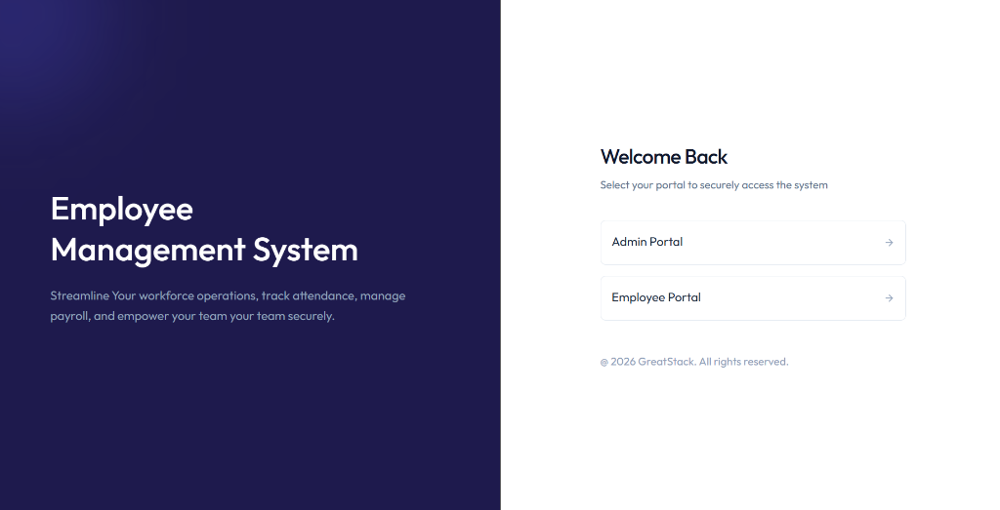

# 🏢 QuickEMS - Employee Management System (Frontend)

[](https://fullstack-ems-five.vercel.app)
[](https://react.dev)
[](https://vitejs.dev)
[](https://tailwindcss.com)

Welcome to the frontend of **QuickEMS**, a premium, state-of-the-art Employee Management System built to streamline corporate workflows, attendance tracking, leave applications, payroll, and profile management with a sleek, interactive, and responsive interface.

---

## 📸 Preview



---

## 🚀 Live URL
Access the live deployed application here:  
👉 **[https://fullstack-ems-five.vercel.app](https://fullstack-ems-five.vercel.app)**

---

## ✨ Features

### 🔑 Authentication & Portal Selection
- **Dual-Portal Access:** Beautiful landing page to choose between **Admin Portal** and **Employee Portal**.
- **Secure Authentication:** JWT-based secure login session management.
- **Robust Password Security:** Interactive and secure password updating system.

### 👑 Admin Portal
- **Dashboard:** Interactive overview showing overall company metrics (Active Employees, Pending Leaves, Present Today, etc.).
- **Employee Directory:** View, create, update, and gracefully deactivate employee profiles.
- **Leave Operations:** Process leave requests (Approve/Reject) in real-time.
- **Payslips & Payroll:** Generate and issue monthly payslips for active employees.

### 💼 Employee Portal
- **Interactive Sidebar:** Seamlessly view and transition between portals and pages.
- **Real-Time Attendance:** Dynamic, single-click **Check-In/Check-Out** tracking system.
- **Leave Application:** Submit leave requests with specific types (Sick, Casual, Annual) and track their approval status.
- **Payslips & PDF Printing:** View all historical payslips and generate clean, print-ready PDF payslips with exact financial breakdowns.
- **Profile & Bio Customization:** Personalize profile information and update your public bio seamlessly.

---

## 🛠️ Detailed Tech Stack & Client Architecture

### ⚛️ React.js (Component-Based UI)
- **Why React?** Component-driven development allows dividing pages into reusable, isolated modules (e.g. `LoginForm`, `Sidebar`, `EmployeeCard`).
- **State Management:** Utilizes the global **Context API (`AuthContext`)** to handle live logged-in user profiles, token verification states, loading triggers, and logout functions globally.

### ⚡ Vite (High-Performance Bundler)
- **Why Vite?** Extremely fast Cold Starts and Hot Module Replacement (HMR) based on native ES modules, significantly accelerating development and yielding clean production builds.

### 🎨 TailwindCSS & Vanilla CSS (Modern Fluid Design)
- **Why Tailwind CSS?** Enables utility-first rapid layout creation with fully responsive layouts matching sleek corporate dashboard aesthetics.
- **Design Tokens:** Merged with curated custom design styles (glassmorphism cards, interactive button classes, and fade-in animations) for a premium, unified user experience.

### 🔗 Axios (Interceptors & API Layer)
- **What does it do?** Houses an instance (`api`) mapping to the backend `/api/v1` base URL. Features a **Request Interceptor** that automatically extracts the session token from `localStorage` and appends it to the `Authorization` header on all outgoing network calls, securing all API paths silently.

### 🛠️ Lucide React (Subtle Micro-Icons)
- **Why Lucide?** High-quality, clean, and customizable vector icons (like `Settings`, `Lock`, `Save`, `UserIcon`) to deliver premium visual details and interactive hover states.

---

## 📁 Detailed Directory Structure

```text
Frontend/
├── public/                 # Static Assets & Metadata
│   └── preview.png         # Main application visual screenshot for documentation
├── src/
│   ├── api/                # API Client Layer
│   │   └── axios.js        # Configures Axios instance with automatic JWT Authorization headers
│   ├── assets/             # Images, static datasets, and dummy assets
│   ├── components/         # Reusable UI Component Modules
│   │   ├── attendance/     # Components for checking in and showing histories
│   │   │   └── CheckInButton.jsx # Interactive check-in action button
│   │   ├── leave/          # Modules for applying and displaying leave applications
│   │   │   ├── ApplyLeaveModal.jsx # Slide-in/modal leave request form
│   │   │   └── LeaveHistory.jsx    # Displays leave status lists
│   │   ├── payslips/       # Components to render and issue monthly payslips
│   │   │   ├── GeneratePayslipsForm.jsx # Dialog to create and dispatch payslips
│   │   │   └── PayslipList.jsx          # Historical payslips listings
│   │   ├── ChangePasswordModal.jsx # Dynamic credentials update dialog
│   │   ├── EmployeeCard.jsx        # Visual card for individual employee info
│   │   ├── EmployeeForm.jsx        # Standardized create/update employee profiles form
│   │   ├── Loading.jsx             # Beautiful fluid loading screen
│   │   ├── LoginForm.jsx           # Core credential submission and validation form
│   │   ├── LoginLeftSide.jsx       # Beautiful persistent panel for login branding
│   │   ├── ProfileForm.jsx         # Custom setting forms to update public bios
│   │   └── Sidebar.jsx             # Sleek, responsive navigation panel
│   ├── context/            # Context API Providers
│   │   └── AuthContext.jsx # Global provider managing token states and authentication sessions
│   ├── pages/              # Main Page Views (Dashboard Panels)
│   │   ├── Attendance.jsx  # Main real-time check-in and historical logs screen
│   │   ├── Dashboard.jsx   # Summary metrics dashboard for admins and employees
│   │   ├── Employees.jsx   # List/grid viewing for employee directories
│   │   ├── Layout.jsx      # Global wrapper routing pages inside the Sidebar
│   │   ├── Leave.jsx       # Interface to manage and request leave days
│   │   ├── LoginLanding.jsx# Entry screen for selecting Admin or Employee portals
│   │   ├── Payslips.jsx    # View and generate employee payroll summaries
│   │   ├── PrintPaysplips.jsx # Print-ready, styled PDF rendering view for single payslips
│   │   └── Settings.jsx    # Account settings, bio updates, and password changes page
│   ├── index.css           # Core styling system with modern custom utility tokens
│   ├── App.jsx             # Handles path-routing configuration and secure route guards
│   └── main.jsx            # React app mount and entry point
├── package.json            # Scripts & frontend dependencies listing
└── vite.config.js          # Vite config with dev-server proxy and alias paths
```

---

## 📦 Installation & Local Setup

### 📋 Prerequisites
Ensure you have [Bun](https://bun.sh/) or [Node.js](https://nodejs.org/) installed.

### 🚀 Getting Started

1. **Clone the repository and navigate to the Frontend directory:**
   ```bash
   cd employee-management-system/Frontend
   ```

2. **Install Dependencies:**
   Using Bun:
   ```bash
   bun install
   ```
   Or using npm:
   ```bash
   npm install
   ```

3. **Configure Environment Variables:**
   Create a `.env` file in the root of the `Frontend` directory:
   ```env
   VITE_BASE_URL=http://localhost:8080
   ```

4. **Run the Development Server:**
   Using Bun:
   ```bash
   bun run dev
   ```
   Or using npm:
   ```bash
   npm run dev
   ```

5. **Build for Production:**
   Using Bun:
   ```bash
   bun run build
   ```
   Or using npm:
   ```bash
   npm run build
   ```
