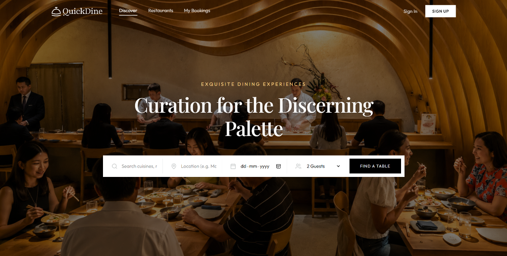
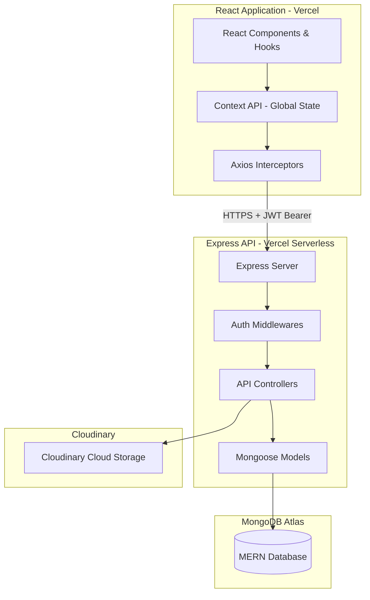
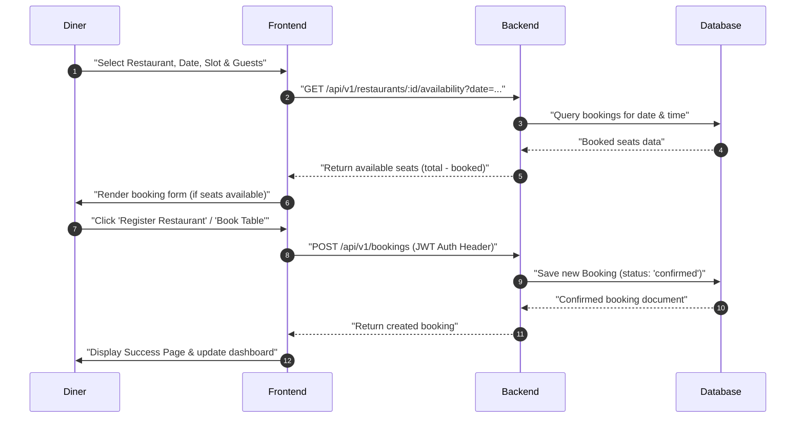
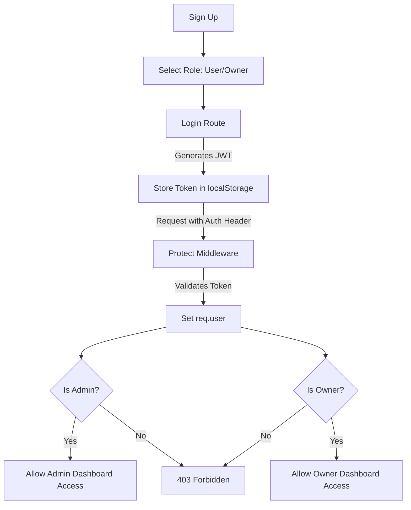

# 🍽️ QuickDine - Premium Multi-Restaurant Booking Platform

[](https://opensource.org/licenses/MIT)
[](https://react.dev/)
[](https://nodejs.org/)
[](https://www.mongodb.com/)
[](https://tailwindcss.com/)
[](https://www.typescriptlang.org/)

**QuickDine** is a state-of-the-art, premium multi-restaurant booking and reservation management system designed to connect discerning diners with exceptional culinary venues. The platform delivers a high-end, responsive booking experience for food enthusiasts while providing restaurant owners and administrators with powerful management tools.

### 🔗 Live URL
👉 **[https://quick-dine-two.vercel.app/](https://quick-dine-two.vercel.app/)**

### 📸 Project Preview


---

## 📌 Table of Contents

- [Overview](#-project-overview)
- [Key Features](#-key-features)
- [Live Demo & Screenshots](#-project-demo)
- [System Architecture](#-system-architecture)
- [Complete Workflow](#-complete-workflow)
- [Tech Stack](#-tech-stack)
- [Folder Structure](#-folder-structure)
- [Authentication Flow](#-authentication-flow)
- [Database Design](#-database-design)
- [API Overview](#-api-overview)
- [Installation Guide](#-installation-guide)
- [Environment Variables](#-environment-variables)
- [Deployment Guide](#-deployment-guide)
- [Security Features](#-security-features)
- [Performance Optimizations](#-performance-optimizations)
- [Future Improvements](#-future-improvements)

---

## 📖 Project Overview

### What is the project?
**QuickDine** is a MERN Stack web application that streamlines the table booking and reservation management processes for restaurants. It features a complete reservation lifecycle, from exploring cuisines and checking live slot capacity to making role-restricted approvals.

### Why was it built?
Traditional booking systems are often single-tenant or lack real-time slot capacity checks, leading to double bookings and coordination bottlenecks. QuickDine was created to provide a unified portal that accommodates multiple stakeholders—Diners, Restaurant Owners, and Platform Administrators—under a single, polished interface.

### Problem Statement
*   **For Diners**: Checking table availability, choosing preferred time slots, and securing immediate reservations without calling.
*   **For Owners**: Onboarding their establishments, managing capacity limits, and controlling approvals.
*   **For Admins**: Auditing newly registered restaurants to maintain platform quality.

### Solution
A seamless web app where restaurants specify capacity limits and time slots. Diners see availability calculated dynamically on the fly based on current bookings. Owners approve/reject registrations, and administrators audit platform traffic.

---

## ✨ Key Features

### 👤 User (Diner) Features
*   **Interactive Search & Filter**: Browse restaurants by name, cuisine, location, price range, and rating.
*   **Dynamic Slot Check**: View real-time availability of table seats for chosen dates and times.
*   **Seamless Reservations**: Book tables with options for occasion types (Birthday, Anniversary, etc.) and special dining requests.
*   **Personal Dashboard**: Monitor upcoming, past, and completed bookings, with cancellation capabilities.

### 🏢 Restaurant Owner Features
*   **Single-Establishment Onboarding**: Setup a restaurant profile with description, location, cuisine, pricing, custom slots, and capacity limits.
*   **Live Booking Management**: View incoming table reservations and update booking status (Approve, Reject, or Cancel).
*   **Capacity Control**: Set capacity limits (default to 20 seats per slot) to automatically prevent overbooking.

### 🛡️ Admin Features
*   **Auditing Console**: Approve or reject new restaurant registration requests to activate them.
*   **Analytics Dashboard**: View aggregate platform statistics (total users, total owners, registered venues, and aggregate bookings) alongside recent booking logs.

---

## 🏗️ System Architecture

QuickDine utilizes a clean, decoupling frontend-backend architecture:



---

## 🔄 Complete Workflow

The following diagram illustrates the request lifecycle for a diner making a table reservation:



---

## 🛠️ Tech Stack

### Frontend & Styling
| Technology | Description |
| --- | --- |
| **React 19** | Modern UI rendering library with functional components |
| **Vite** | Fast, modern build tool and dev server |
| **TypeScript** | Strict compile-time typing for robust code structure |
| **Tailwind CSS v4** | Utility-first responsive styling framework |
| **React Router v7** | Routing and route-guards |
| **Lucide React** | Premium icon library |
| **React Hot Toast** | Non-blocking dashboard toast notifications |

### Backend & Database
| Technology | Description |
| --- | --- |
| **Node.js** | JavaScript runtime environment |
| **Express 5** | Minimalist web application router framework |
| **MongoDB Atlas** | Document-oriented cloud database |
| **Mongoose 9** | Object Data Modeling (ODM) library for MongoDB |
| **JSON Web Tokens** | Stateless client authentication (JWT) |
| **Multer** | Multipart form-data parser middleware for image handling |
| **Cloudinary SDK** | Cloud repository for uploading restaurant banner assets |

---

## 📁 Folder Structure

```text
multi-restaurant-booking-platform/
├── backend/
│   ├── src/
│   │   ├── config/             # DB and storage configurations
│   │   ├── controllers/        # Express handlers (Auth, Admin, Booking, Owner)
│   │   ├── middlewares/        # JWT parsing and role authorization guards
│   │   ├── models/             # Mongoose Schemas (User, Restaurant, Booking)
│   │   ├── routes/             # Express Routers
│   │   └── server.ts           # Server entry point
│   ├── types/                  # Shared TS interfaces
│   ├── utils/                  # Helper utilities (Cloudinary, JWT helpers)
│   ├── package.json
│   └── vercel.json             # Vercel Serverless deploy config
├── frontend/
│   ├── src/
│   │   ├── assets/             # Images & static graphics
│   │   ├── components/         # Reusable widgets (Navbar, Footer, AuthModal)
│   │   ├── context/            # AppContext API (auth state & methods)
│   │   ├── lib/                # Axios api client instance
│   │   ├── pages/              # Page layouts (Home, Search, Details, Dashboards)
│   │   ├── App.tsx             # Route definitions
│   │   └── main.tsx            # React bootstrap file
│   ├── package.json
│   └── vercel.json             # Vercel Frontend route redirect rule
└── README.md
```

---

## 🔐 Authentication Flow

QuickDine implements stateless JWT authentication combined with Role-Based Access Control (RBAC):



---

## 🗄️ Database Design

The MongoDB database consists of three primary, interconnected collections:

```mermaid
erDiagram
    User ||--o{ Booking : "makes"
    User ||--o| Restaurant : "owns"
    Restaurant ||--o{ Booking : "receives"

    User {
        ObjectId _id PK
        string name
        string email
        string password
        string phone
        string role "user | owner | admin"
        date createdAt
    }

    Restaurant {
        ObjectId _id PK
        string name
        string slug
        string description
        string cuisine
        string priceRange "$ | $$ | $$$ | $$$$"
        number rating
        number reviewCount
        string location
        string address
        string image "Cloudinary URL"
        string chef
        array tags
        array availableSlots
        boolean featured
        boolean exclusive
        ObjectId owner FK
        string status "pending | approved | rejected"
        number totalSeats
    }

    Booking {
        ObjectId _id PK
        ObjectId user FK
        ObjectId restaurant FK
        date date
        string time
        number guests
        string occasion
        string specialRequests
        string status "confirmed | cancelled | completed"
        string bookingId "UUID Reference"
    }
```

---

## 🚀 Installation Guide

### Prerequisites
*   Node.js (v18 or higher)
*   npm (v9 or higher)
*   A MongoDB Atlas database cluster

### 1. Clone the Project
```bash
git clone https://github.com/Surajgupta001/MERN-STACK-PROJECT.git
cd MERN-STACK-PROJECT
```

### 2. Backend Setup
```bash
cd backend
npm install
```
Create a `.env` file inside `backend/`:
```env
PORT=3000
MONGODB_URI=your_mongodb_atlas_uri
JWT_SECRET=your_jwt_secret_key
CLOUDINARY_CLOUD_NAME=your_cloudinary_name
CLOUDINARY_API_KEY=your_cloudinary_api_key
CLOUDINARY_API_SECRET=your_cloudinary_api_secret
```
Run the development backend:
```bash
npm run server
```

### 3. Frontend Setup
```bash
cd ../frontend
npm install
```
Create a `.env` file inside `frontend/`:
```env
VITE_API_URL=http://localhost:3000/api/v1
```
Run the development frontend:
```bash
npm run dev
```

---

## 🔒 Security Features

*   **Password Hashing**: Passwords stored in the database are hashed using **bcrypt**.
*   **Stateless Sessions**: JWT tokens are signed using a high-entropy secret key and sent securely via standard authorization headers (`Bearer <token>`).
*   **Role Authorization Guards**: API endpoints are strictly protected by middlewares checking user roles (`ownerOnly`, `adminOnly`).
*   **CORS Enabled**: Backend handles Cross-Origin requests securely using the Express `cors` middleware.

---

## ⚡ Performance Optimizations

*   **HMR Build System**: Managed via Vite for near-instant rendering modifications during development.
*   **Query Indexing**: Mongoose model schemas query by indexed parameters like `slug` and `owner` to ensure fast search lookup speeds.
*   **Asset Management**: Images uploaded for restaurant banners are hosted on **Cloudinary CDN** to guarantee high delivery speeds and optimization.
*   **Lazy Loading**: Booking metrics and detailed lists are loaded conditionally in the UI to minimize DOM weight.

---

## 🤝 Contributing

Contributions are welcome! Please feel free to open a Pull Request or report bugs in the issues tab.

---

## 📄 License

This project is licensed under the MIT License. See [LICENSE.md](./LICENSE.md) for details.

---

## 👤 Author

*   **Suraj Gupta** - [GitHub Profile](https://github.com/Surajgupta001)
