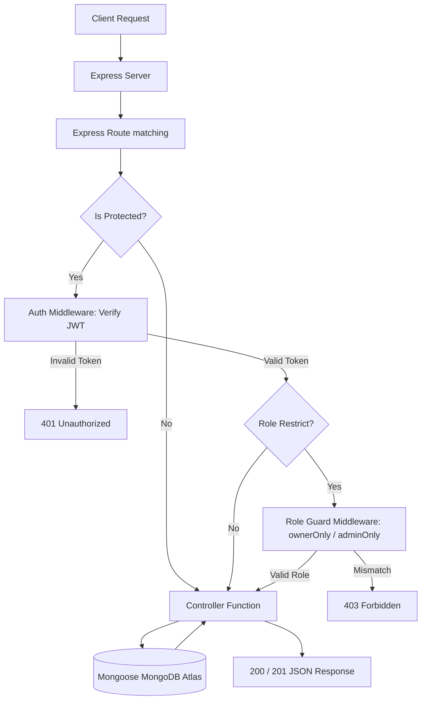
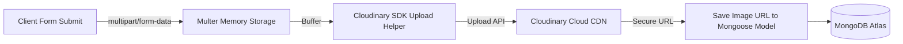

# ⚙️ QuickDine - Backend REST API Server

Welcome to the backend server documentation for **QuickDine** – a modern, premium table booking and reservation platform. This backend is built using **Node.js**, **Express**, **TypeScript**, and **MongoDB/Mongoose**.

---

## 📌 Table of Contents

- [Overview](#-overview)
- [Architecture](#-architecture)
- [Folder Structure](#-folder-structure)
- [Tech Stack](#-tech-stack)
- [Request Lifecycle](#-request-lifecycle)
- [Authentication & Access Control](#-authentication--access-control)
- [Middlewares](#-middlewares)
- [Controllers & Services](#-controllers--services)
- [API Route Specifications](#-api-route-specifications)
- [Database Schemas](#-database-schemas)
- [Image Upload Integration](#-file-upload-integration)
- [Error Handling & Security](#-security--error-handling)

---

## 📖 Overview

The QuickDine backend handles core database management, reservation validation, stateless authentication sessions, image storage integration, and access control. It processes real-time slot seat calculations for diners while providing administrative statistics dashboards and approval interfaces.

---

## 🏗️ Architecture

The backend follows the **MVC (Model-View-Controller)** pattern. Since this is a REST API, the "View" is replaced by JSON response payloads sent to the client.

```text
 Client Request
       ↓
    Routing Layer (routes/)
       ↓
  Middleware Layer (auth middleware, multer)
       ↓
 Controller Layer (controllers/)
       ↓
  Model Layer (models/ Schemas)
       ↓
   Database (MongoDB Atlas)
```

---

## 📁 Folder Structure

```text
backend/
├── src/
│   ├── config/             # DB connection & Multer upload configuration
│   │   ├── database.ts
│   │   └── multer.ts
│   ├── controllers/        # Route logic handlers (MVC Controllers)
│   │   ├── admin.controllers.ts
│   │   ├── auth.controllers.ts
│   │   ├── booking.controllers.ts
│   │   ├── owner.controllers.ts
│   │   └── restaurant.controllers.ts
│   ├── middlewares/        # Security authentication & check middlewares
│   │   └── auth.middleware.ts
│   ├── models/             # Mongoose MongoDB Data Schemas
│   │   ├── booking.models.ts
│   │   ├── restaurant.models.ts
│   │   └── user.models.ts
│   ├── routes/             # API Endpoints Router Definitions
│   │   ├── admin.routes.ts
│   │   ├── auth.routes.ts
│   │   ├── booking.routes.ts
│   │   ├── owner.routes.ts
│   │   └── restaurant.routes.ts
│   └── server.ts           # Express Application setup & global configuration
├── types/                  # TypeScript interface definitions
├── utils/                  # Utility helpers (Cloudinary API, JWT creation)
├── package.json
└── tsconfig.json
```

---

## 🛠️ Tech Stack

*   **Runtime**: Node.js
*   **Web Framework**: Express (v5.x for modern routing APIs)
*   **Language**: TypeScript
*   **ODM (Database Library)**: Mongoose (v9.x)
*   **Database**: MongoDB Atlas Cloud
*   **Session Token**: JSON Web Token (JWT)
*   **Password Hashing**: Bcrypt
*   **Storage Repository**: Cloudinary SDK (Image Cloud Hosting)
*   **Multi-part Parser**: Multer (Buffer processing)

---

## 🔄 Request Lifecycle

The flow diagram below displays how a typical authenticated request is processed in the system:



---

## 🔒 Authentication & Access Control

1.  **Registration**: Users choose their role (`user`, `owner`, or `admin`). Passwords are automatically hashed via `bcrypt` with a salt factor of 10 before storage.
2.  **Login Verification**: Authenticated login credentials generate a signed JSON Web Token (JWT) with the user ID and role in the payload.
3.  **Route-Guard Middlewares**:
    *   `protect`: Parses the authorization header (`Bearer <token>`), verifies the token signature, and attaches the user document to `req.user`.
    *   `ownerOnly`: Blocks any request if `req.user.role !== 'owner'`.
    *   `adminOnly`: Blocks any request if `req.user.role !== 'admin'`.

---

## 🛠️ Middlewares

The backend utilizes built-in and custom middlewares:

*   **`cors()`**: Configures CORS access controls to prevent cross-origin blocks.
*   **`express.json()`**: Parses incoming JSON request body structures.
*   **`protect`**: Decodes JWT headers and populates `req.user` details.
*   **`ownerOnly`**: REST API path guard restricting access to restaurant owners.
*   **`adminOnly`**: REST API path guard restricting access to master platform admins.
*   **Global Error Handler**: Catches all unhandled syntax or runtime database exceptions, returning a clean 500 error payload.

---

## 📁 Controllers & Services

*   **`auth.controllers.ts`**: Register accounts, sign in users, and fetch authenticated profiles (`/me`).
*   **`restaurant.controllers.ts`**: Public restaurant search, detailed listing fetching, and live capacity calculation queries.
*   **`booking.controllers.ts`**: Handle reservation submissions, checks capacity overlap limits, cancels bookings, and serves diner lists.
*   **`owner.controllers.ts`**: Manage owner-specific venue parameters (create/update) and process bookings received by the owner's restaurant.
*   **`admin.controllers.ts`**: System aggregate analysis queries and status update controllers (Approve/Reject) for pending restaurant profiles.

---

## 📡 API Route Specifications

All endpoints are prefix-routed on `/api/v1`.

### 🔑 Authentication (`/auth`)
*   `POST /auth/register` - Register a new user account.
*   `POST /auth/login` - Sign in to obtain a session token.
*   `GET /auth/me` - [Protected] Retrieve the logged-in user profile.

### 🍽️ Restaurants (`/restaurants`)
*   `GET /restaurants` - Search and filter restaurants.
*   `GET /restaurants/featured` - Retrieve featured/exclusive restaurants list.
*   `GET /restaurants/:slug` - Fetch details of a single restaurant by its unique URL slug.
*   `GET /restaurants/:id/availability` - Calculate open slots and seat availability for a given date query (`?date=YYYY-MM-DD`).

### 📅 Bookings (`/bookings`)
*   `POST /bookings` - [Protected] Book a table. Validates capacity prior to creation.
*   `GET /bookings/my` - [Protected] Retrieve active/completed bookings for the logged-in user.
*   `PUT /bookings/:id/cancel` - [Protected] Cancel a booking.

### 🏢 Owner Portal (`/owner`)
*   `GET /owner/restaurant` - [Protected, Owner] Retrieve the owner's restaurant profile.
*   `POST /owner/restaurant` - [Protected, Owner] Create a new restaurant profile.
*   `PUT /owner/restaurant` - [Protected, Owner] Update profile details and slot configs.
*   `GET /owner/bookings` - [Protected, Owner] List all reservations received by the owner's venue.
*   `PUT /owner/bookings/:id/status` - [Protected, Owner] Update reservation status (`confirmed`, `cancelled`, `completed`).

### 🛡️ Admin Management (`/admin`)
*   `GET /admin/restaurants` - [Protected, Admin] List all restaurants on the platform.
*   `PUT /admin/restaurants/:id/approve` - [Protected, Admin] Approve or reject a restaurant's registration request.
*   `GET /admin/stats` - [Protected, Admin] Get platform analytics (total users, bookings, venues, etc.).

---

## 🗄️ Database Schemas

### User Schema (`user.models.ts`)
```typescript
{
  name: { type: String, required: true },
  email: { type: String, required: true, unique: true },
  password: { type: String, required: true },
  phone: { type: String, required: true },
  role: { type: String, enum: ['user', 'admin', 'owner'], default: 'user' }
}
```

### Restaurant Schema (`restaurant.models.ts`)
```typescript
{
  name: { type: String, required: true },
  slug: { type: String, required: true, unique: true },
  description: { type: String, required: true },
  cuisine: { type: String, required: true },
  priceRange: { type: String, enum: ["$", "$$", "$$$", "$$$$"], required: true },
  rating: { type: Number, default: 5.0 },
  reviewCount: { type: Number, default: 0 },
  location: { type: String, required: true },
  address: { type: String, required: true },
  image: { type: String, default: '' },
  chef: { type: String, required: true },
  tags: [{ type: String }],
  availableSlots: [{ type: String }],
  featured: { type: Boolean, default: false },
  exclusive: { type: Boolean, default: false },
  owner: { type: Schema.Types.ObjectId, ref: "User", required: true },
  status: { type: String, enum: ['pending', 'approved', 'rejected'], default: 'pending' },
  totalSeats: { type: Number, default: 20 }
}
```

### Booking Schema (`booking.models.ts`)
```typescript
{
  user: { type: Schema.Types.ObjectId, ref: "User", required: true },
  restaurant: { type: Schema.Types.ObjectId, ref: "Restaurant", required: true },
  date: { type: Date, required: true },
  time: { type: String, required: true },
  guests: { type: Number, required: true },
  occasion: { type: String },
  specialRequests: { type: String },
  status: { type: String, enum: ['confirmed', 'cancelled', 'completed'], default: 'confirmed' },
  bookingId: { type: String, required: true, unique: true }
}
```

---

## 📤 File Upload Integration

QuickDine supports image uploads using **Multer** and **Cloudinary CDN**:



---

## 🔒 Security & Error Handling

### Security Best Practices
*   **Password Encryption**: Auto-hashes plain-text user passwords using **Bcrypt**.
*   **JWT Expiry & Guards**: Session signatures are validated statelessly for protected paths.
*   **Data Validation**: Controllers manually enforce validations for required parameters, email sanity checks, and capacity constraints before execution.

### Global Error Handling
Errors inside route controllers are handled using standard try-catch patterns that forward parameters to a global Express error middleware:

```typescript
app.use((err: Error, req: Request, res: Response, next: NextFunction) => {
    console.error('Unhandled Error:', err);
    res.status(500).json({
        success: false,
        message: err.message || 'Server Error',
        stack: process.env.NODE_ENV === 'production' ? undefined : err.stack
    });
});
```
This design prevents application crashes due to unexpected runtime bugs.
