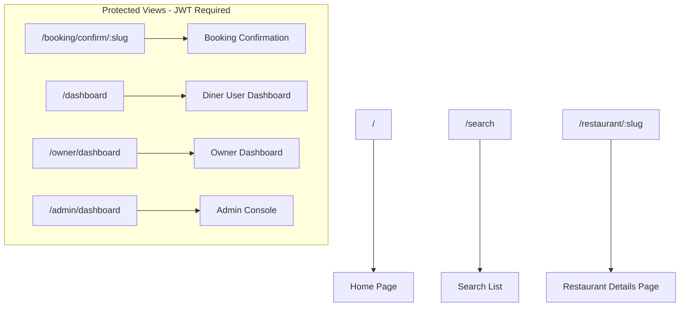
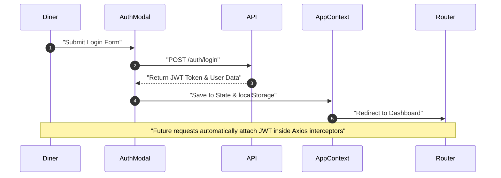

# 💻 QuickDine - Frontend Web Application

Welcome to the frontend documentation for **QuickDine** – a modern, premium table booking and reservation platform built with **React 19**, **Vite**, **TypeScript**, and **Tailwind CSS v4**.

---

## 📌 Table of Contents

- [Overview](#-overview)
- [Tech Stack](#-tech-stack)
- [Key Features](#-features)
- [Folder Structure](#-folder-structure)
- [Routing & Page Layouts](#-routing)
- [State Management](#-state-management)
- [Authentication Flow](#-authentication-flow)
- [API Integration](#-api-integration)
- [Components & Custom Styling](#-styling)
- [Forms & Input Validation](#-forms)
- [Performance & Best Practices](#-performance-optimizations)

---

## 📖 Overview

The QuickDine frontend is a single-page application (SPA) focused on delivering an elegant, intuitive UI for making and managing restaurant reservations. It incorporates custom landing views, a search portal with real-time filters, dynamic booking validation, and dedicated layouts for users, restaurant owners, and platform administrators.

---

## 🛠️ Tech Stack

*   **Core Library**: React 19 (Functional components, hooks, Context API)
*   **Build Utility**: Vite (Instant hot-reloads, fast production bundler)
*   **Language**: TypeScript (Strict typings for component props and state)
*   **Styling**: Tailwind CSS v4 (Modern CSS features, native grid layouts)
*   **Routing**: React Router v7 (Client-side routers and route-guards)
*   **HTTP Client**: Axios (Equipped with request interceptors for automated JWT injection)
*   **Icons**: Lucide React (Premium SVG icons)
*   **Toasts**: React Hot Toast (Non-blocking notifications)

---

## ✨ Features

*   **Dynamic Search Portal**: Client-side filtering of cuisines, prices, reviews, and geographic locations using reactive search parameters.
*   **Interactive Booking Widget**: Date-picker integration that calls the availability endpoint to list real-time seat capacities per slot.
*   **Responsive Control Dashboards**:
    *   **Diner**: Track, review, or cancel active table reservations.
    *   **Owner**: Update restaurant details (address, capacity, tags, slots, banner image) and approve/reject bookings.
    *   **Admin**: View platform metrics graphs and process pending establishment approvals.

---

## 📁 Folder Structure

```text
frontend/
├── public/                 # Static public assets (icons, manifest)
├── src/
│   ├── assets/             # Global CSS style parameters and images
│   ├── components/         # Reusable frontend components
│   │   ├── admin/          # AdminApprovals, AdminStats
│   │   ├── booking/        # BookingSuccess, BookingSummary
│   │   ├── home/           # Hero, CuisineBrowse, TrendingRow, MembershipSection
│   │   ├── owner/          # OwnerBookings, RestaurantWizard, OwnerProfileDetails
│   │   ├── restaurant/     # RestaurantHero, RestaurantInfo, BookingWidget, RestaurantReviews
│   │   ├── AuthModal.tsx   # Login/Signup modal overlay
│   │   ├── Navbar.tsx      # Global dynamic header
│   │   ├── Footer.tsx      # Global footer
│   │   ├── Loader.tsx      # Spinning loading indicator
│   │   └── ProtectedRoute.tsx # Auth & Role route guard
│   ├── context/
│   │   └── AppContext.tsx  # Global auth & user state provider
│   ├── lib/
│   │   └── api.ts          # Axios client instance with request JWT interceptor
│   ├── pages/
│   │   ├── admin/          # AdminDashboard.tsx
│   │   ├── owner/          # OwnerDashboard.tsx
│   │   ├── BookingConfirmation.tsx
│   │   ├── Dashboard.tsx   # Diner User dashboard
│   │   ├── Home.tsx        # Landing Page
│   │   ├── RestaurantDetail.tsx # Venue details & slot selection
│   │   └── Search.tsx      # Search list page
│   ├── App.tsx             # Routes configuration
│   ├── index.css           # Tailwind configuration & global overrides
│   └── main.tsx            # Application entrypoint
├── package.json
├── tsconfig.json
└── vercel.json             # Vercel deployment route routing rules
```

---

## 🗺️ Routing

The application uses client-side routing managed by **React Router v7**. Private views are protected by `<ProtectedRoute>` to handle role-based navigation.



---

## 🧠 State Management

Global state is handled by the **React Context API** inside `AppContext.tsx`. It keeps track of the authenticated user, JWT token, and provides authentication methods:

*   `user`: Current user object (name, email, role, etc.).
*   `token`: JWT string for request authentication headers.
*   `login(email, password)`: Sends request to API, saves token to `localStorage`, and fetches user context.
*   `register(name, email, password, phone, role)`: Registers new diner/owner profiles.
*   `logout()`: Clears memory, deletes token from `localStorage`, and updates state to null.

---

## 🔒 Authentication Flow

When a page refreshes, the context automatically audits `localStorage` for a stored token and runs a validation check against `/auth/me` to restore the active session.



---

## 🔗 API Integration

The API client is defined in `lib/api.ts` as a reusable Axios instance. It is configured with an request interceptor to automatically attach the user's token:

```typescript
// Automatically inject JWT token into requests
api.interceptors.request.use(
    (config) => {
        const token = localStorage.getItem("token");
        if (token) {
            config.headers.Authorization = `Bearer ${token}`;
        }
        return config;
    },
    (error) => Promise.reject(error)
);
```

---

## 🎨 Styling & Component Library

*   **Tailwind CSS v4**: Built entirely on utility classes, avoiding bulky third-party libraries and ensuring clean stylesheets.
*   **Responsive Layouts**: Fully responsive interface using Tailwind's breakpoints (`sm`, `md`, `lg`, `xl`). Elements gracefully transition from mobile stack to desktop grid grids.
*   **Design Tokens**: Customizable styles, custom font weights, dynamic borders, and sleek, minimalist animations (like `animate-spin` on loader components).

---

## 📝 Forms & Input Validation

The forms are managed via standard React controlled inputs to capture user entries.
*   **Form Validation**: Validations are enforced during input submission to verify parameters like valid email structures, matching passwords, and minimum passenger count rules.
*   **Feedback Delivery**: Interactive validation errors and success details are served to the user using `react-hot-toast` notifications.

---

## ⚡ Performance Optimizations & Best Practices

*   **Vite Hot Module Replacement (HMR)**: Extremely fast compilation updates in development.
*   **Axios Response Interceptors**: Catches server-side auth errors automatically.
*   **State Condensation**: Component state parameters are declared locally where possible to limit rendering cascades across the UI tree.
*   **Image Caching**: Cover and thumbnail images are served via Cloudinary CDN which automatically scales and compresses graphics according to screen widths.
